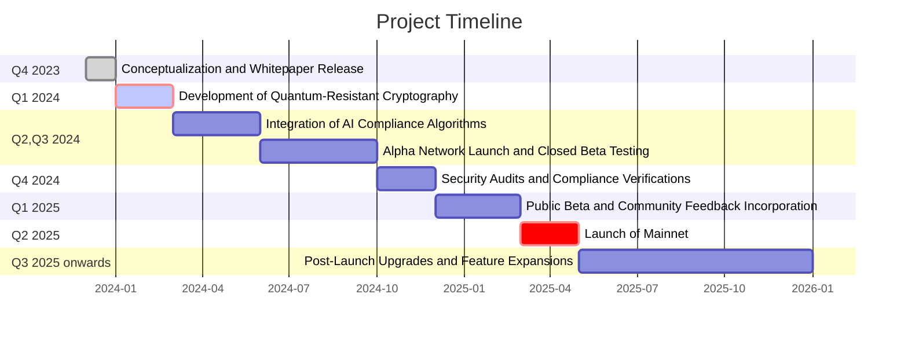

## Abstract

QuantumAILedger(QAILedger or QAIL) represents a pioneering approach to cryptocurrency, designed to operate within the emerging landscape of quantum computing and enhanced AI capabilities. It offers a secure, stable, and regulatory-compliant medium of exchange, leveraging quantum-resistant encryption to safeguard against evolving cyber threats and utilizing AI algorithms for real-time monitoring to uphold stringent anti-money laundering and anti-terrorism financing norms. This whitepaper outlines the technological innovations, governance structure, and strategic implementation roadmap of QAILedger, aiming to set a new standard in the digital currency space for security, efficiency, and ethical compliance. QAILedger is not just a transactional tool but a forward-looking solution equipped to adapt to the rapidly advancing future of fintech.

## Introduction

The advent of blockchain technology heralded a revolution in digital finance, providing a means for secure, decentralized transactions. However, as the landscape evolves, the emergence of quantum computing poses a significant threat to current cryptographic standards, while regulatory compliance demands increasingly sophisticated solutions. QAILedger emerges as a response to these challenges, offering a cryptocurrency that not only withstands potential quantum computer-enabled vulnerabilities but also integrates advanced artificial intelligence to ensure real-time regulatory adherence and fraud detection. This whitepaper introduces QAILedger's innovative approach, combining quantum-resistant cryptography with AI-driven monitoring, setting a new benchmark in the intersection of cryptocurrency and cutting-edge technology. We will explore the market need, the technology stack, and the strategic vision that drives QAILedger to be a leader in secure, compliant, and efficient digital transactions.

## Background

The inception of blockchain and the subsequent development of cryptocurrencies have revolutionized digital transactions, providing an unprecedented level of security and decentralization. Despite these advancements, the industry faces significant challenges, notably in security and regulatory compliance. The advent of quantum computing threatens to undermine the cryptographic foundations of current blockchain technologies, while financial crimes and regulatory evasion remain persistent threats. Additionally, the growing need for transparent and real-time monitoring systems is evident as global financial bodies call for stricter controls. 

## Technology Overview

QAILedger is built upon a robust blockchain foundation, incorporating cutting-edge advancements in quantum-resistant cryptographic algorithms to secure against potential quantum computing threats. Our blockchain architecture is designed with a modular approach, allowing for seamless upgrades and integration of new technologies as they emerge. The integration of artificial intelligence and machine learning offers an additional layer of security, actively monitoring transactions for fraudulent activity and ensuring compliance with global financial regulations in real time. This section provides an in-depth analysis of the cryptographic methods employed, the AI algorithms at work, and the overall technological infrastructure that makes QAILedger an innovative force in the cryptocurrency domain.

### Infrastructure 

_Consensus Algorithm_: QAILedger implements a hybrid Proof-of-Stake (PoS) system that is quantum-resistant, allowing for energy efficiency and robust security against quantum attacks.

_Block Structure_: QAILedger uses blocks with a dynamic size mechanism to adapt to network demands, ensuring scalability and efficient processing.

_Transaction Capacity_: Optimized network can handle a high TPS rate through sharding or similar scalability solutions, ensuring quick and cost-effective transactions.

_Network Nodes_: QAILedger runs on a distributed network of nodes with hardware requirements that facilitate AI processing and quantum-safe cryptographic computations, incentivized through a reward mechanism linked to the PoS consensus.

This solution would form a secure, scalable, and efficient foundation for the QAILedger blockchain.

### Cryptography 

_Algorithm Choice_: a combination of lattice-based cryptographic systems for key exchange (like New Hope) and hash-based signatures (such as XMSS or LMS) to secure transactions against quantum attacks.

_Key Management_: advanced key management protocols that support frequent key rotation and post-quantum secure key storage solutions.

_Encryption Layers_: Utilize multiple layers of encryption for data-at-rest and data-in-transit, ensuring that even if one layer is compromised, others still provide security.

_Public Key Infrastructure (PKI)_: a PKI that is quantum-resistant, ensuring that all participants in the network have verified and secure identities.

These cryptographic specifications are designed to maintain the integrity and security of the QAILedger blockchain, protecting against both current and future cryptographic threats.

### AI Compliance Monitoring

_Machine Learning Models_: supervised learning for known fraud patterns and unsupervised learning for anomaly detection in transactional data.

_Data Analysis_: natural language processing (NLP) to analyze and understand transaction narratives, aiding in the identification of suspicious activities.

_Real-time Monitoring_: real-time monitoring decentralized systems that flag transactions based on a risk-scoring model developed from historical data; each system has indepentent verification to ensure tamper-proof architecture.

_Regulatory Reporting_: automatically-generated reports for regulatory scrutiny, utilizing AI to ensure accuracy and completeness of data.

These systems will enable QAILedger to proactively monitor compliance, ensuring the network adheres to global financial regulations.

## Regulatory Compliance

QAILedger commits to the highest standards of regulatory compliance, integrating an AI-powered compliance framework that adheres to international Anti-Money Laundering (AML) and Combating the Financing of Terrorism (CFT) regulations. Utilizing real-time monitoring and analysis, the system is designed to detect and report suspicious activities automatically, ensuring all transactions on the network uphold the integrity demanded by global financial institutions. This section will outline the mechanisms QAILedger employs to conform to these regulatory standards, the protocols for reporting and transparency, and the ongoing collaboration with regulatory bodies to maintain compliance in a rapidly evolving legislative landscape.

_Compliance Protocols_: QAILedger utilizes advanced document verification APIs for KYC (know your customer) that can process and authenticate government-issued IDs from various countries, integrating with blockchain-based identity verification systems. For AML and CTF checks, it employs transaction monitoring systems similar to Chainalysis and Elliptic, which use pattern recognition and machine learning to detect suspicious blockchain activities.

_Regulatory Alignment_: cross-chain analysis tools capable of tracing asset flows in accordance with the FATF’s Travel Rule, ensuring data about transaction senders and receivers is accurately recorded and shared with compliant institutions.

_Audit Trails_: smart contracts that automatically log all transaction details in a separate but linked off-chain databases to ensure scalability while maintaining data integrity, enabling real-time access for audits without congesting the main blockchain.

_Automated Compliance Updates_: AI system trained on regulatory texts, based on IBM Watson Discovery, which can parse and interpret updates in regulatory documents, triggering system updates to compliance protocols through smart contract triggers when new regulatory patterns are identified.

## Tokenomics

The tokenomics of QAILedger are structured to incentivize security, utility, and growth within its ecosystem. The distribution strategy ensures broad accessibility while supporting network security and development. Initial coin allocation is directed towards supporting the network infrastructure, research and development, community incentives, and reserve funds for future scalability and unforeseen challenges. 

_Token Distribution_: there is a total supply of 100 million tokens, the distribution is: 20% through an ICO, 20% reserved for the development team and advisors (vested over four years to align long-term interests), 30% for ecosystem incentives, 15% for strategic partnerships, and 15% held as a reserve for future contingencies.

_Funding Allocation_: Assuming the ICO raises $50 million. The allocation will be as follows: 40% for development and research, 20% for marketing and community development, 15% for legal and regulatory compliance, 15% for operations, and 10% for an emergency fund.

_Staking Rewards_: advanced staking protocols generate a 5% annual yield paid out from transaction fees to encourage holding and network participation.

## Governance

The governance of QAILedger is designed to be transparent, inclusive, and adaptable, ensuring that the network evolves in line with the community's needs and technological advancements. The governance framework outlines the processes for proposing, debating, and implementing changes to the network. It includes a decision-making body comprising diverse stakeholders, including developers, token holders, and industry experts.

_Community Voting_: a decentralized autonomous organization (DAO) structure where token holders can propose changes via a formalized proposal system, similar to Ethereum's EIPs (Ethereum Improvement Proposals). Votes can be weighted based on the number of tokens held or through a quadratic voting system to prevent wealth concentration from dictating all decisions.

_Election of Council_: a governing council elected by token holders for fixed terms. Token holders could elect seven council members annually to oversee major decisions, similar to the MakerDAO's governance framework.

_Transparent Proposal System_: platforms like Aragon or Snapshot are used for transparent proposal submissions and voting, where every action is recorded on-chain for accountability.

_On-chain Governance Mechanisms_: smart contracts that automatically enforce certain decisions based on the outcome of community votes, ensuring that the governance process is not just a recommendation but is binding and automatically executed on the blockchain.

## Security

Security is paramount in the design and operation of QAILedger. The platform employs state-of-the-art quantum-resistant cryptographic techniques to safeguard against both classical and quantum computational attacks. In this section, we explain the layered security approach, which encompasses the encryption of transactions, secure wallet interactions, and network consensus integrity. We also detail our incident response strategy, including regular security audits, bug bounty programs, and a rapid response team for vulnerability management. The aim is to maintain an impregnable security posture that instills trust and resilience in the face of evolving cyber threats.

_Quantum-resistant Encryption_: a set of cryptographic primitives such as NTRU or Falcon for key encapsulation and digital signatures which are considered secure against quantum attacks as per NIST’s Post-Quantum Cryptography Standardization process.

_Multi-factor Authentication (MFA)_: MFA integration for all wallet and account access points, requiring biometrics or hardware tokens in addition to passwords.

_Smart Contract Audits_: Engagement with firms like Trail of Bits or OpenZeppelin for regular, comprehensive smart contract audits to identify and mitigate vulnerabilities before they can be exploited.

_Bug Bounty Programs_: a bug bounty program, managed through platforms like HackerOne, incentivizing white hat hackers to find and report security issues.

_Network Monitoring_: ai-backed security operations centers (SOCs) with 24/7 network monitoring for detecting and responding to anomalies in real-time, applying machine learning for predictive threat analysis.

## Implementation Roadmap

The Implementation Roadmap of QAILedger charts the strategic roll-out of the cryptocurrency platform, beginning with the initial development phase and culminating in full public release. Key milestones include:

## Use Cases

QAILedger aims to serve a broad spectrum of financial transactions and services. Key use cases include:

Cross-Border Transactions: Offering a secure and cost-effective alternative for international trade and remittances.
Supply Chain Transparency: Providing immutable records for the provenance tracking of goods.
Smart Asset Management: Enabling intelligent and self-executing contracts for asset distribution.
Regulatory Reporting: Streamlining compliance reporting for financial institutions.
Secure Identity Verification: Utilizing quantum-resistant cryptography for identity services and access management.
Each use case will be explored for its potential impact, implementation considerations, and the value it adds to the QAILedger ecosystem.

## Partnerships and Collaborations

Strategic partnerships and collaborations are essential to the growth and success of QAILedger. 

_Academic Partnerships_: we will form partnerships with leading universities such as MIT and Stanford for research on quantum cryptography and AI algorithms. For example, engaging with Stanford's AI lab to refine machine learning models for transaction monitoring.

_Financial Institutions_: collaborate with banking entities like JPMorgan or HSBC to integrate QAILedger for international settlements, using it to improve the speed and security of cross-border transactions.

_Regulatory Collaborations_: work with regulatory bodies like the Financial Conduct Authority (FCA) in the UK or the Securities and Exchange Commission (SEC) in the US to ensure compliance and explore new frameworks for digital assets.

_Technology Alliances_: partner with tech firms such as Amazon, IBM, and Google for cloud infrastructure that supports the extensive computational needs of QAILedger's AI systems and quantum encryption processes in the initial phases of deployment.

## Future Work

QAILedger is committed to continuous improvement and innovation. Future work will focus on:

_Ongoing Technological Advancements_: Staying at the forefront of quantum computing and AI to ensure the network's encryption and analysis capabilities remain cutting-edge.
_Scalability Solutions_: Exploring and implementing new technologies and protocols that will allow the network to grow sustainably while maintaining high performance.
_Expanded Regulatory Compliance_: Adapting to new regulations and international standards as they develop.
_Community-Driven Features_: Incorporating feedback to enhance user experience and expand use cases.

## Conclusion

QAILedger stands at the intersection of tradition and innovation in the cryptocurrency space, offering a secure, efficient, and compliant financial instrument adaptable to the quantum future. This whitepaper has laid out the vision, technology, and roadmap for a platform that not only meets today's demands but also anticipates tomorrow's challenges. As we move forward, we invite the community, developers, and visionaries to join us in refining and realizing the potential of QAILedger, ensuring it remains a trusted and valuable asset for years to come.

